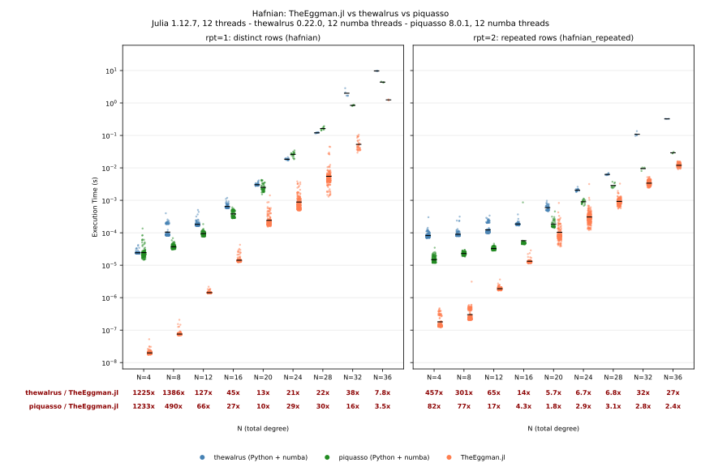
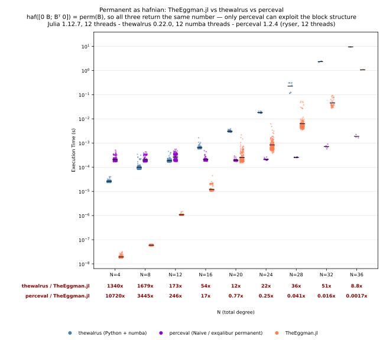

# TheEggman

[](https://QuantumSavory.github.io/TheEggman.jl/stable/)
[](https://QuantumSavory.github.io/TheEggman.jl/dev/)
[](https://github.com/QuantumSavory/TheEggman.jl/actions/workflows/CI.yml?query=branch%3Amain)
[](https://codecov.io/gh/QuantumSavory/TheEggman.jl)

A Julia port of [thewalrus](https://github.com/XanaduAI/thewalrus), Xanadu's library of matrix
functions for Gaussian quantum optics.

So far it implements the hafnian:

```julia
using TheEggman

A = [0 1 2 3
     1 0 4 5
     2 4 0 6
     3 5 6 0]

hafnian(A)                    # 28.0 == 1*6 + 2*5 + 3*4

# Hafnian of the matrix with row/col i repeated rpt[i] times, without ever building it.
B = [1.0 2.0; 2.0 3.0]
hafnian_repeated(B, [2, 2])   # 11.0
```

Both accept any 1-based `AbstractMatrix` and read it in place — views and `Symmetric` wrappers are
never copied. Both validate symmetry, which is `O(N²)` and therefore a real fraction of the cost at
small `N`; pass `check_symmetric=false` in a hot loop where the input is known to be symmetric.

Loop hafnians are not implemented yet.

## Algorithm

`hafnian` sums `∏ A[i,j]` over all perfect matchings of the row indices. Three strategies cover the
range, chosen per problem by comparing costs that are all known in advance. `method=:unrolled`,
`:dp` or `:sieve` overrides the choice.

**`:unrolled` — degrees up to `TheEggman.UNROLL_MAX` (12).** Evaluates the definition as a single
branch-free expression emitted by a `@generated` function. Expanding the matching sum naively would
produce `(N-1)!!` products — 10395 at `N = 12` — so the generator memoises on the remaining-index
bitmask and emits one temporary per distinct subset, collapsing the code to the size of the
underlying DAG (232 subsets, 1055 multiplies at `N = 12`). Allocation-free, and the fastest option
at these sizes once repeated-call GC is counted.

**`:dp` — degrees up to `TheEggman.DP_MAX` (32).** The same recursion, evaluated at runtime over
memoised subsets. Because it always pairs off the *smallest* remaining index, the subsets it reaches
are constrained to `F(K+1)` of them — a Fibonacci number, so the state space grows like `φ^K ≈
1.618^K`, not `2^K`, and the transition count like `K φ^K`. That is worse asymptotically than the
sieve's `K³ 1.414^K` — their exact counts cross at `K ≈ 62` — but across the whole computable range
the sieve does 65–100× more arithmetic:

| K              | 12   | 16    | 20    | 24     | 28      | 32       |
|----------------|------|-------|-------|--------|---------|----------|
| DP transitions | 1076 | 10226 | 89665 | 748776 | 6052062 | 47786401 |
| sieve work     | 106k | 1.0M  | 7.9M  | 54M    | 393M    | 2.1G     |

The subset structure depends only on the degree, so it is precomputed once per `K` into a cached
plan, and the evaluation is a flat CSR walk with no hashing or bitmask arithmetic — each transition
one packed `Int32`. Levels are evaluated in order and split across tasks within a level, where the
states are mutually independent; results are bit-identical regardless of thread count. Plans cost
4 bytes per transition and are built on first use: 0.4 MB / 3 ms at `N = 20`, 25 MB / 0.2 s at
`N = 28`, 196 MB / 2.1 s at `N = 32`, then cached for the session.

`DP_MAX = 32` is a representation limit, not a performance crossover: the DP is still 9.6× faster
than the sieve there (11.3 ms against 108.7 ms), and extrapolating the growth rates puts parity near
`N ≈ 60`, far beyond what either method could hold in memory. What binds is the packed `Int32`
transition — at `N = 32` it needs 9 bits of pair index plus 22 of state index, exactly the 31
available, and `N = 34` needs 34 bits under any split. Because plan construction is amortised only
across repeated calls, a *single* cold hafnian at `N = 32` is faster with `method=:sieve` (0.11 s
against 2.13 s of plan build); the DP comes out ahead from roughly the 22nd call on.

Past that the DP is still the faster algorithm, so `method=:dp` can be requested explicitly up to
`TheEggman.DP_HARD_MAX` (64, where a subset stops fitting in a `UInt64` bitmask). Those degrees use
an `Int64` layout — at `N = 34` that is a 1.06 GB plan, 6.5 s to build, after which the DP runs in
56.5 ms against the sieve's 249.9 ms. It is never chosen automatically, because the plan grows to
21 GB by `N = 40` and 160 GB by `N = 44`; the builder refuses up front, quoting the size, rather
than letting the allocation take the machine down. This is meant for large-memory machines.

Parallel scaling tops out near 4× on 12 threads rather than approaching the thread count: two
indirect loads per multiply make the loop memory-bound once several cores are running. Degrees below
`N ≈ 20` run serially, where the levels are too small to repay a spawn.

**`:sieve` — everything else.** The `O(N³ 2^(N/2))` sieve of
[Björklund, Gupt & Quesada](https://arxiv.org/abs/2108.01622), the algorithm `thewalrus` uses. It is
the fallback above `DP_MAX`, and it is also the *best* choice whenever repeated rows shrink it far
enough — `hafnian_repeated` pairs repeats into as few distinct edges as possible, turning the sieve
into a short mixed-radix sum over multiplicities, so e.g. `rpt = fill(2, 14)` sieves where 28
distinct rows would use the DP.

Where the sieve diverges from `thewalrus` is in its inner loop. `thewalrus` extracts the
generating-function coefficient from power traces `tr(Mᵏ)` built by `k` explicit matrix products,
`O(m⁴)` per sieve term. TheEggman.jl instead uses

```
exp( Σ tr(Mᵏ) λᵏ / 2k ) = det(I - λM)^(-1/2)
```

and reads every coefficient off the characteristic polynomial of `M` in one `O(m³)` pass
(Hessenberg reduction, then La Budde's recurrence). Two further choices, both measured rather than
assumed: the Hessenberg reduction uses Gaussian similarity transforms with partial pivoting
(half the flops of Householder, with no meaningful accuracy cost at these sizes), and for
`Complex{Float64}`/`Complex{Float32}` it runs on split real/imaginary arrays, which vectorise where
interleaved complex storage does not. The sieve is spread across threads once it is large enough to
be worth it; the other two strategies are single-threaded.

The sieve comes in two variants and the cheaper one is chosen per problem, the same way the strategy
is. Inclusion–exclusion always runs more terms — 2× for distinct rows, 1.5× at `rpt = 2` — but its
multiplicities can hit zero, dropping edges and shrinking the submatrix each term works on. For
distinct rows that shrinkage wins outright; once rows repeat, Glynn's multiplicities can vanish too,
only the term count is left, and Glynn wins. Speedup of the variant chosen over the other one:

| chosen                          | N=20  | N=24  | N=28  | N=34  | N=36  |
|---------------------------------|-------|-------|-------|-------|-------|
| distinct rows → inclusion–excl. | 1.32× | 1.47× | 1.71× | 1.80× | 2.05× |
| repeated rows → Glynn           | 1.49× | 1.75× | 1.54× | —     | —     |

Accuracy points the same way for repeated rows and the opposite way for distinct ones:
inclusion–exclusion sums terms much larger than the answer and relies on cancellation, costing one
to two decimal digits. Against a `BigFloat` reference, Glynn holds `1e-14`–`5e-14` where
inclusion–exclusion runs `3e-13`–`3e-11` — a 24–744× spread, and 105× on the worst of twelve draws
at `N = 20`. So on repeated rows the automatic choice is strictly better on both counts; on distinct
rows it trades those digits for the speed. Pass `glynn=true` to force accuracy over speed.

Both direct strategies are far more accurate than either sieve variant — machine precision (`2e-16`
measured) — since they sum products of matrix entries with no cancellation at all. Results agree
with `thewalrus` to ~1e-14 relative where a direct strategy runs, and to ~1e-12 where the default
sieve does.

## GPU

The subset DP runs on a GPU through [KernelAbstractions.jl](https://github.com/JuliaGPU/KernelAbstractions.jl),
as an opt-in package extension — the base package still depends on nothing but `LinearAlgebra`:

```julia
using TheEggman, CUDA, KernelAbstractions

hafnian(A; backend = CUDABackend())                  # one hafnian
hafnian(As; backend = CUDABackend())                 # a batch of matrices
hafnian_repeated(A, rpts; backend = CUDABackend())   # one matrix, many photon patterns
```

Only the DP is ported, because only the DP is worth porting: it is memory-bandwidth-bound rather
than compute-bound, which is the shape a GPU improves. The unrolled kernels finish in tens of
nanoseconds — less than a single kernel launch — and a sieve term needs roughly a 40 KB workspace,
which would leave almost no occupancy. Anything the DP does not cover falls back to the CPU
automatically.

**Batching is the point, not a convenience.** `P` and `H` are laid out with the instance index
fastest-varying, so a warp covering 32 instances of the same subproblem reads contiguous memory and
follows a single broadcast transition; the other layout would scatter every access. It also
amortises the `N/2` kernel launches each call needs across the whole batch instead of paying them
per hafnian, which is what makes moderate `N` worth sending to a GPU at all.

Nothing is reordered — each state is summed by one thread in plan order, the same order the CPU
uses — but results are **not** bit-identical to the CPU, because device compilers contract
`a*b + c` into a single-rounding FMA. The gap runs ~1e-16 to 2e-15 relative, and against an extended
precision reference the GPU's contracted result is the *more* accurate of the two. Compare across
backends with a tolerance; within one backend, repeated and batched evaluation is exactly
reproducible.

`ComplexF32` needs no separate API — pass a `ComplexF32` matrix. It costs about seven digits and,
because the DP never cancels, that error stays near fp32 epsilon instead of growing with `N`
(measured 2–5e-7 across N=12–24, flat). On consumer cards, where fp64 runs at 1/32–1/64 rate, this
is usually the right default.

Plans are uploaded once per degree and cached, and the device work buffers are reused across calls
rather than reallocated — per-call allocation cost ~21 µs of fixed overhead, which dominates small
batches, and its allocator churn made the scalar path 19× slower than an identical batch of one.
`TheEggman.gpu_cache_bytes()` reports the VRAM plans and buffers hold; `TheEggman.empty_gpu_cache!()`
releases it. Because the buffers are shared, one call at a time runs per backend; device work
serialises anyway. Batches are not chunked automatically, since KernelAbstractions exposes no
portable free-memory query — use `TheEggman.dp_batch_bytes(N, T, B)` to size one, and pass
`max_batch` if it will not fit.

Measured on an RTX 4080 SUPER (16 GB, compute 8.9, fp64 at 1/64 rate) against a 32-thread CPU
baseline, `ComplexF64`. Batched figures at `B ≥ 64`, where the CPU side is also fully parallel:

| N | single call | batched B=64 | batched B=256 |
|---|---|---|---|
| 20 | 0.10× | 0.54× | 0.68× |
| 24 | 0.28× | 0.58× | 4.75× |
| 28 | 0.92× | **16.5×** | 6.4× |
| 32 | 0.51× | **6.9×** | — |

**Use a GPU from about `N = 26` and only for batched work.** Below that the CPU wins outright — the
DP threads well and a single call cannot amortise the per-level kernel launches. A single hafnian
never wins at any size in this sweep.

`ComplexF32` is worth taking on a consumer card: a further **2.3× at N=20, 3.8× at N=24, 4.9× at
N=28**, for about seven digits, and because the DP never cancels that error stays near fp32 epsilon
instead of growing with `N`. Pass `ComplexF32.(A)`.

Plan upload amortises after 3–14 calls at the same degree. Throughput is not monotonic in batch
size, so `max_batch` is worth sweeping for your `N`; the validation script does it.

See [`benchmark/gpu/README.md`](benchmark/gpu/README.md) for the validation script, which also runs
without a GPU in a dry-run mode.

## Benchmarks

```sh
julia benchmark/run_comparison.jl
```

times TheEggman.jl against `thewalrus` and Budapest QCG's
[piquasso](https://github.com/Budapest-Quantum-Computing-Group/piquasso), which run in a shared
isolated [uv](https://docs.astral.sh/uv/)-managed virtualenv, and writes a comparison plot to a
timestamped directory under `.benchmarks/`. See
[`benchmark/competitors/README.md`](benchmark/competitors/README.md) for details and for how to run the
stages individually.

On a 32-thread Ryzen 9 9950X, with mean ratios against TheEggman.jl tabulated under each panel:



`thewalrus` and `piquasso` are independent numba implementations of the same Björklund/Glynn sieve;
piquasso's `hafnian_with_reduction` folds repeats into it the way `hafnian_repeated` does, so it
covers both panels. It is the faster of the two Python libraries in the rpt=2 panel throughout — by
up to 11× — and TheEggman.jl still leads it at every N in the sweep: about 2–3× in rpt=2 from N=20
on, 3.5–30× in rpt=1 over the same range, and three orders of magnitude at the small end where the
unrolled sum runs in tens of nanoseconds. The `hafnian` panel is unrolled at N=8/12 and DP above; `hafnian_repeated` falls back
to the sieve from N=20 on, where repetition has made it the cheapest option, so those entries are
sieve-vs-sieve.

`StrawberryFields` is not benchmarked: it has no hafnian of its own and imports every one from
`thewalrus`, so timing it would time `thewalrus` twice.

### The permanent as a hafnian

```sh
julia benchmark/run_comparison.jl --perceval
```

additionally benchmarks Quandela's [perceval](https://github.com/Quandela/Perceval) and writes a
second image. perceval has no hafnian — it is a Fock-state simulator built entirely on
**permanents** — but the permanent is a hafnian of a block-antidiagonal matrix,

```
perm(B) = haf([0 B; Bᵀ 0])
```

so a `d×d` permanent and a `2d×2d` hafnian return the same number and can be timed head to head.



This is a general-purpose hafnian's worst case by construction: perceval's
`exqalibur.permanent_cx` (the kernel of its `Naive` back-end, a multithreaded C++ Ryser) reads the
answer off `B` in `O(2^d d²)`, while neither `hafnian` implementation detects the structure and both
pay full price on the matrix they are handed. TheEggman.jl wins below the crossover — 17× at N=16,
where the whole call is 12 µs and perceval cannot amortise its thread-pool dispatch — and is 570×
slower by N=36. `thewalrus` trails TheEggman.jl throughout and loses to perceval from N=16 on.
If your matrix really is a permanent, use a permanent routine.

The crossover sits somewhere between `N ≈ 16` and `N ≈ 22` depending on the machine's state:
perceval's fixed dispatch cost is the most load-sensitive number in this whole benchmark, measured
anywhere from 0.15 ms to 1.7 ms per call on the same laptop, and it is what the small-N groups are
made of. The regime is off by default because it exists only to give perceval something to be
compared against, and benchmarking it roughly doubles the two hafnian stages.

Every library here uses every core, so these are wall-clock ratios on a thermally-constrained laptop
and the run-to-run spread is wide — treat the exact multipliers as indicative and the ordering as
the stable part. Timings exclude one-time warmup on every side: numba's JIT for thewalrus and
piquasso, exqalibur's thread-pool spin-up for perceval, DP plan construction for TheEggman.jl.
